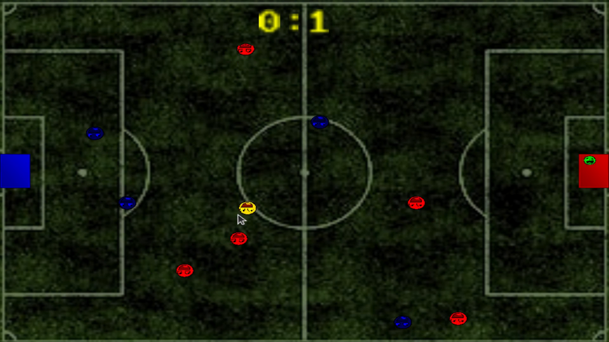

# Simple football game

## 介绍
- OpenGL实现碰撞球类游戏。

## 效果

- 球碰到边界时反弹
- 球碰到球员时反弹且由于重量不同 会被推开加速
- 球进入球门时得分
- 鼠标控制人类球员移动（只有一个）
- 电脑控制AI球员移动（可以有多个 max 5）
- AI球员 防守 进攻 随机游走

## 运行

- 环境：20.04.1-Ubuntu, 系统库： glfw GLEW GL SOIL
- 编译运行：cmake -B build && cmake --build build && ./football

## Sample Imgs

## 游戏实现流程
- 初始化游戏对象
    - 球
    - 球场
    - 球门
    - 球员
    - 分数面板
- 初始化OpenGL窗口，设置键盘及鼠标事件回调
- 渲染循环，更新游戏状态，渲染游戏场景
    - 处理键盘事件及鼠标事件
    - 更新游戏对象状态
        - 碰撞检测及位置修正
            - circle to circle
        - 进球判定
            - check ball in gate
        - AI球员根据球和球门位置更新作出策略更新位置，人类球员根据鼠标位置更新位置
            - AI球员状态机 随机游走，守门员守门，进攻和射门
            - 随机游走：
                - 随机选择一个方向进行移动一段时间，若移动中附近有球则改变状态为进攻
            - 守门员守门：守门员位置总是在球和球门的中间
            - 进攻：AI球员进攻时其位置应该在对方球门和球连线的延长线上，其应该移动该延长线上近球一点，若过程中球远离自己一定距离则改状态为随机游走
            - 射门：进攻状态移动到目标点后，进行射门
    - 渲染游戏各个对象
        - 根据size，position，color，shader，texture，rotation等渲染对象
- 游戏结束，清理资源，退出游戏
